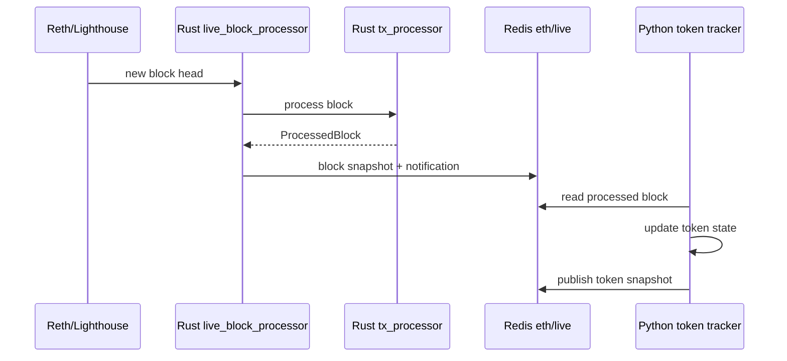

# Ethereum Data Python Package

`eth_data` is the Python access layer around the Rust Ethereum processing stack. Rust owns canonical live block ingestion, block processing, transaction decoding, simulation, and Redis block publication. Python keeps compatibility adapters, Redis readers for downstream consumers, token/position snapshot publishing, database helpers, and analysis scripts.

## Ownership

- Live block processing: Rust `tx_processor` live binary.
- Processed block publication: Rust writes the `eth/live/block/<number>/...` Redis tree and emits block notifications.
- Historical/offline block access from Python: `pyreth.block_processor().process_block(...)`.
- Transaction access from Python: `pyreth.tx_processor()` and `pyreth.block_processor()`.
- Live token consumers: Python reads Rust-published Redis blocks through `RedisSnapshotReader` and publishes token snapshots through `LiveDataPublisher.publish_token()`.

Python should not reimplement receipt/log/trace parsing or live block publication.

## Current Layout

```text
eth_data/
├── live_data_registry/              # Redis key contract, readers, token/position publishers
├── chain_utils/                     # PyReth-backed constants and address metadata
├── reth_chain_query/                # Python-facing Reth query helpers
├── database/                        # Schemas, fetchers, writers
└── utils/                           # Logging and generic helpers
```

Removed legacy Python-owned areas include the old `blockchain` package, Python live block processor, MCP server, generic Redis notification wrapper, and `tx_alert`.

## Live Data Registry

`live_data_registry` is kept because it is the shared Redis contract between Rust and Python.

Rust writes:

```text
eth/live/latest/block_number
eth/live/latest/block_hash
eth/live/blocks
eth/live/recent_blocks
eth/live/block/<number>/meta
eth/live/block/<number>/header
eth/live/block/<number>/txs
eth/live/block/<number>/tx_index
eth/live/block/<number>/addresses
eth/live/block/<number>/chain_state_snapshot
```

Python reads those keys through `RedisSnapshotReader` and writes derived snapshots:

```text
eth/live/token/snapshot/<token_address>
eth/live/token/snapshot/index
eth/live/position/<portfolio_id>/<token_address>
```

`LiveDataPublisher` intentionally has no `publish_block()` API. Block publication belongs to Rust.

## Data Flow



## Common Python APIs

### Process Historical Blocks

```python
from pyreth import block_processor

processor = block_processor()
result = processor.process_block(25_000_000)
```

### Fetch Processed Transactions

```python
from pyreth import block_processor

provider = block_processor()
tx = provider.processed_transaction_by_hash("0x...")
```

### Read Live Blocks From Redis

```python
from eth_data.live_data_registry import RedisSnapshotReader

reader = RedisSnapshotReader()
latest = reader.get_latest_block_number()
block = reader.get_block(latest)
```

### Publish Token Snapshots

```python
from eth_data.live_data_registry import LiveDataPublisher

publisher = LiveDataPublisher()
await publisher.publish_token(token_address, snapshot)
```

## Runtime Configuration

Live block services are configured in the Rust binary and systemd units under:

```text
/home/nima/code/crypto/deploy/systemd/blockchains/ethereum
```

Important runtime settings:

- Ethereum HTTP RPC: usually `http://127.0.0.1:8545`
- Ethereum WebSocket RPC: usually `ws://127.0.0.1:8546`
- Redis: `LIVE_BLOCKCHAIN_DATA_REDIS_URL`, defaulting to `redis://localhost:6379/0`
- PyReth: installed from `/home/nima/code/crypto/blockchains/eth/reth/pyreth`

Check services with:

```bash
systemctl status eth-live-block-processor.service
systemctl status reth.service
systemctl status lighthouse-beacon.service
```

## Testing

Run focused Python tests with the relevant package roots on `PYTHONPATH`:

```bash
PYTHONPATH=/home/nima/code/crypto/blockchains/eth/pyeth/eth_data \
pytest -q pyeth/eth_data/tests/live_data_registry/test_publisher.py

PYTHONPATH=/home/nima/code/crypto/blockchains/eth/pyeth/eth_data:/home/nima/code/crypto/blockchains/eth/pyeth/eth_token:/home/nima/code/crypto/blockchains/eth/pyeth/eth_token/eth_token \
pytest -q pyeth/eth_token/tests/token_manager/test_block_token_processor.py
```

PyReth must import successfully before running tests that touch processing:

```bash
python -c "import pyreth; print(pyreth.__version__)"
```

## Cleanup Rules

- Do not add new Python block processors.
- Do not add Python Redis block publishers.
- Prefer PyReth/Rust for transaction, block, simulation, and Reth DB access.
- Keep Python modules that provide Redis readers, token/position snapshot publication, database models, and downstream consumer glue.
