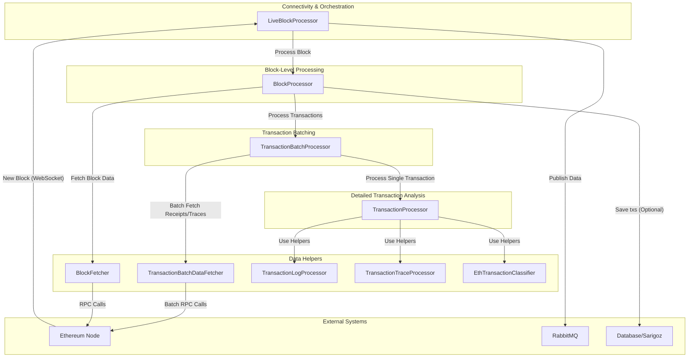
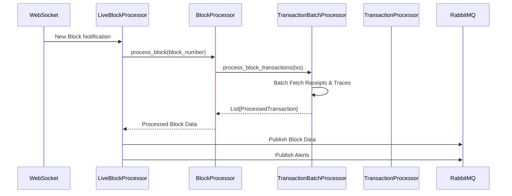

# Ethereum Block and Transaction Processor

## 1. Objective and Architecture

The `eth_data` is a high-performance Python system designed to monitor the Ethereum blockchain in real-time. It ingests new blocks, dissects every transaction within them, and outputs a rich, structured data format suitable for advanced analytics, trading systems, and monitoring. The system is built for resilience and speed, leveraging asynchronous processing and optimized RPC batching.

### Core Architecture

The system is composed of several layers, each with a distinct responsibility, ensuring a clean separation of concerns.

## 2. Core Components

### `LiveBlockProcessor`
- **Responsibility**: The main entry point of the system.
- Manages WebSocket connection to the Ethereum node for instant new block notifications.
- Orchestrates the entire processing pipeline for each new block.
- Manages the connection to RabbitMQ, publishing processed block data and transaction alerts to designated exchanges (`blocks_exchange`, `tx_alerts_exchange`).
- Implements robust reconnection logic with exponential backoff for both the Ethereum node and RabbitMQ, ensuring high availability.

### `BlockProcessor`
- **Responsibility**: To process a single block or a range of blocks.
- Takes a block number as input.
- Uses `BlockFetcher` to retrieve the full block data, including the list of transaction objects.
- Delegates the processing of the block's transactions to the `TransactionBatchProcessor`.
- Optionally, it can save the final processed transactions to a database via a `TransactionWriter` (from the `baygus` project).

### `TransactionBatchProcessor`
- **Responsibility**: To efficiently process all transactions within a single block.
- This is a key performance component. It uses `TransactionBatchDataFetcher` to retrieve all transaction receipts and traces for the entire block in a small number of batched RPC calls. This dramatically reduces network latency compared to fetching them one by one.
- Once all data is fetched, it processes each transaction concurrently using `asyncio.create_task`.
- It delegates the detailed analysis of each individual transaction to the `TransactionProcessor`.

### `TransactionProcessor`
- **Responsibility**: To dissect a single transaction and extract all relevant information.
- This component performs the deepest analysis.
- **Log Processing**: Uses `TransactionLogProcessor` to decode event logs from the receipt (e.g., ERC20/721/1155 transfers, Uniswap swaps, approvals).
- **Trace Processing**: Uses `TransactionTraceProcessor` to parse the transaction trace and identify internal ETH transfers.
- **Classification**: Uses `EthTransactionClassifier` to assign a high-level category (e.g., "Swap", "Transfer", "Contract Creation").
- **Action Identification**: Identifies more specific actions (e.g., "Swap ETH for Token").
- **Data Aggregation**: Calculates transaction fees, bribe amounts, and aggregates all unique addresses involved.
- **Output**: Assembles all extracted data into a final, comprehensive `ProcessedTransaction` object.

## 3. Data Flow and Processing Pipeline

The end-to-end workflow is as follows:

## 4. Key Algorithms and Optimizations

### Algorithm: Single Block Processing

1.  `LiveBlockProcessor` receives a new block header from the WebSocket subscription.
2.  It invokes `BlockProcessor.process_block(block_number)`.
3.  `BlockProcessor` fetches the full block data, which includes a list of transaction objects.
4.  `BlockProcessor` passes this list to `TransactionBatchProcessor.process_block_transactions`.
5.  **Optimization**: `TransactionBatchProcessor` makes batch RPC calls to the node to get all transaction receipts and all transaction traces for the block. This is the most significant performance optimization.
6.  `TransactionBatchProcessor` creates an `asyncio` task for each transaction.
7.  Each task calls `TransactionProcessor.process_transaction` with the transaction, its receipt, and its trace.
8.  `TransactionProcessor` decodes logs, parses traces, classifies the transaction, and returns a rich `ProcessedTransaction` object.
9.  The results are gathered and returned up the call stack.
10. `LiveBlockProcessor` publishes the final data to RabbitMQ.

### Output Data Model: `ProcessedTransaction`

The final output for each transaction is a rich dataclass containing dozens of fields, including:
- Basic transaction info (hash, from, to, value, status, etc.).
- A breakdown of transaction fees.
- Classified transaction type and specific actions.
- Decoded event logs, categorized into lists like `erc20_transfers`, `uniswap_v2_swaps`, `erc20_approval_events`, `erc721_approval_events`, etc.
- A list of `InternalTransaction` objects representing ETH transfers between contracts.
- A comprehensive set of all unique addresses involved in the transaction.

## 5. Configuration and Dependencies

### Configuration
The system is configured via parameters passed to the `LiveBlockProcessor`, typically sourced from environment variables:
- `websocket_url`: The WebSocket URL of the Ethereum node.
- `http_url`: The HTTP RPC URL of the Ethereum node.
- `rabbitmq_url`: The connection URL for the RabbitMQ server.
- `index_address_txs`: A boolean flag to enable/disable writing address participation to the index database.

### Dependencies
- **Core**: `web3.py`, `aio_pika` (for RabbitMQ), `orjson`.
- **`baygus`**: This module has a dependency on the `baygus` project for database writing (`TransactionWriter`) and stablecoin analysis. This means it is designed to work as part of a larger analytics ecosystem and is not fully standalone.
