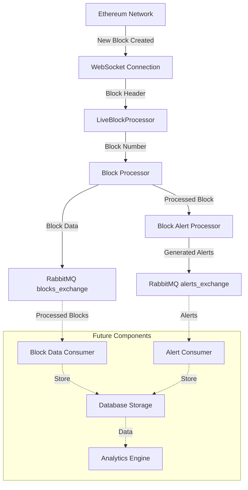

# Ethereum Real-Time Block Processing and Alert System

## System Overview

The system monitors Ethereum blockchain in real-time, processes blocks and transactions, and generates alerts based on specific patterns. It's designed for high performance, reliability, and extensibility.

## Data Flow Architecture

## Current Implementation

### 1. Block Monitoring and Processing
- **WebSocket Subscription**: Receives real-time block notifications
- **Block Processing**: Extracts and processes transaction details
- **Data Extraction**: Identifies various transaction types:
  * ERC20/721/1155 transfers
  * Internal transactions
  * Contract interactions
  * Contract creations

### 2. Alert Generation
- **Transaction Analysis**: Examines each transaction for patterns
- **Concurrent Processing**: Processes multiple transactions simultaneously
- **Alert Types**:
  * Trading enabled alerts
  * Bribe detection
  * Contract creation monitoring
  * Address monitoring (Grey/Orca/Whale)

### 3. Message Distribution
- **RabbitMQ Integration**:
  * blocks_exchange: Distributes processed block data
  * alerts_exchange: Distributes generated alerts
- **Persistent Messaging**: Ensures reliable delivery
- **Error Recovery**: Automatic reconnection and reinitialization

## Planned Next Steps

### 1. Data Consumption Layer
- Implement consumers for blocks and alerts
- Store processed data in appropriate databases
- Enable real-time data access and querying

### 2. Storage System
- **Block Data**: Store processed blocks for historical analysis
- **Alert Storage**: Maintain alert history with relationships
- **Address Tracking**: Track address behaviors and patterns

### 3. Decision Making Layer
- **Txn Submission**: Submit transactions to the blockchain for execution based on alert conditions

### 4. Monitoring and Management
- Alert statistics and reporting

## System Requirements

### Performance
- Process blocks within 1 second of creation
- Handle high transaction volumes
- Maintain low latency alert generation

### Reliability
- No missed blocks
- Reliable alert generation
- Data consistency

### Scalability
- Handle increasing transaction volumes
- Easy integration of new alert types
- Extensible storage system

## Future Considerations

### 1. Advanced Analytics
- Historical trend analysis
- Network behavior patterns
- Risk scoring

### 2. Enhanced Monitoring
- Real-time performance metrics
- System health dashboards
- Alert effectiveness tracking

