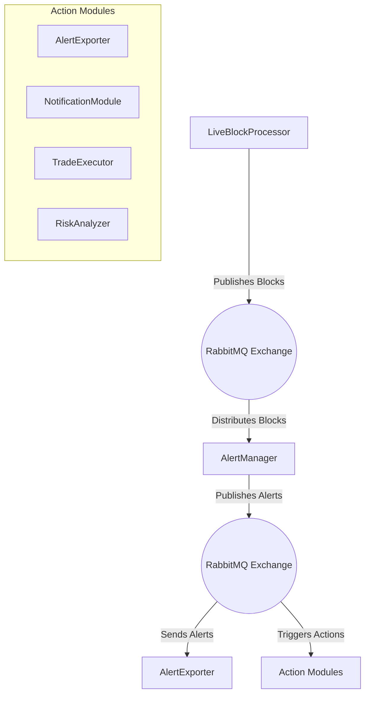
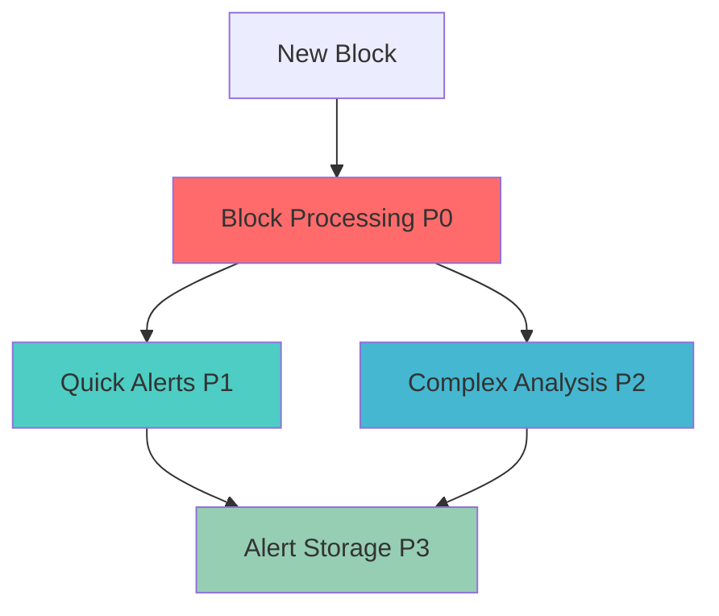

# Ethereum Alert System Architecture
Create a high-performance, extensible alert system for monitoring Ethereum blockchain transactions in real-time, with focus on:
- Scalable async processing
- Configurable alert conditions
- Easy integration of new alert types
- Efficient storage and retrieval
- Reliable message distribution using RabbitMQ

---

### **Installing `aio_pika`**

To install `aio_pika`, which is an asynchronous messaging library for RabbitMQ in Python, follow these steps:

1. **Activate Your Python Virtual Environment** (if you are using one):

   If you're working within a virtual environment (recommended), activate it first:

   ```bash
   source /path/to/your/venv/bin/activate
   ```

   Replace `/path/to/your/venv/` with the actual path to your virtual environment.

2. **Install `aio_pika` Using `pip`**:

   Run the following command to install `aio_pika`:

   ```bash
   pip install aio-pika
   ```

   If you're not using a virtual environment and need to install it system-wide, you might need to use `sudo`:

   ```bash
   sudo pip install aio-pika
   ```

   However, using a virtual environment is strongly recommended to avoid permission issues and to keep your system Python clean.

3. **Verify the Installation**:

   You can verify that `aio_pika` is installed by listing installed packages:

   ```bash
   pip list | grep aio-pika
   ```

   Or check the package details:

   ```bash
   pip show aio-pika
   ```

   This should display information about the `aio-pika` package, confirming that it's installed.

---

## **System Architecture**

### **1. Core Components**



- **LiveBlockProcessor**: Fetches new blocks in real-time and publishes them to RabbitMQ.
- **RabbitMQ Exchange**: Acts as a message broker, distributing blocks and alerts to consumers.
- **AlertManager**: Consumes blocks from RabbitMQ, processes alerts, and publishes alert messages.
- **AlertExporter and Action Modules**: Consume alerts from RabbitMQ for storage or triggering actions.

### **2. Priority Hierarchy and Processing Flow**

#### **Priority Levels**



1. **Critical (P0) - Block Processing**
   - Block ingestion must never be blocked
   - Maximum latency: None (immediate processing)
   - No dependencies on alert processing

2. **High (P1) - Quick Alerts**
   - Maximum latency: 1 second per block
   - Alert Types:
     * Trading enabled detection
     * Bribe detection
     * Grey/Orca address monitoring
     * Whale movement detection

3. **Medium (P2) - Complex Analysis**
   - Maximum latency: 5 seconds
   - Alert Types:
     * Contract creation analysis
     * Hidden mint detection
     * Pattern recognition

4. **Low (P3) - Storage Operations**
   - No strict latency requirements
   - Operations:
     * Alert persistence
     * Historical analysis
     * Database maintenance

#### **Implementation**

```python
from enum import IntEnum
from dataclasses import dataclass
from typing import Optional, List

class AlertPriority(IntEnum):
    CRITICAL = 0  # Block processing
    HIGH = 1      # Quick alerts
    MEDIUM = 2    # Complex analysis
    LOW = 3       # Storage & maintenance

@dataclass
class AlertTask:
    priority: AlertPriority
    alert_type: str
    max_latency: Optional[float]
    batch_size: Optional[int] = None

class AlertManager:
    def __init__(self):
        self.alert_tasks: Dict[str, AlertTask] = {
            'trading_enabled': AlertTask(AlertPriority.HIGH, 'trading_enabled', 1.0),
            'bribe': AlertTask(AlertPriority.HIGH, 'bribe', 1.0),
            'grey_address': AlertTask(AlertPriority.HIGH, 'grey_address', 1.0),
            'whale': AlertTask(AlertPriority.HIGH, 'whale', 1.0),
            'contract_creation': AlertTask(AlertPriority.MEDIUM, 'contract_creation', 5.0),
            'hidden_mint': AlertTask(AlertPriority.MEDIUM, 'hidden_mint', 5.0, batch_size=10),
        }
        
    async def process_alerts(self, block_data: BlockData) -> None:
        # Create tasks based on priority
        high_priority = [task for task in self.alert_tasks.values() 
                        if task.priority == AlertPriority.HIGH]
        medium_priority = [task for task in self.alert_tasks.values() 
                         if task.priority == AlertPriority.MEDIUM]
        
        # Process high priority alerts immediately
        high_priority_results = await asyncio.gather(
            *[self._process_alert(task, block_data) for task in high_priority]
        )
        
        # Schedule medium priority alerts
        medium_priority_task = asyncio.create_task(
            self._process_medium_priority(medium_priority, block_data)
        )
        
        # Schedule storage operations with low priority
        storage_task = asyncio.create_task(
            self._store_alerts(high_priority_results)
        )
```

### **3. Component Details**

#### **3.1 Alert Manager**
- Handles async coordination of alert processing
- Manages alert priorities and deduplication
- Provides unified interface for alert registration
- Enforces priority-based processing
- Manages resource allocation
- Monitors processing latencies

```python
class AlertManager:
    """
    Coordinates async alert processing and manages alert lifecycle
    
    Features:
    - Async alert processing using asyncio
    - Alert batching and prioritization
    - Alert deduplication
    - Error handling and retry logic
    - Priority-based async processing
    - Resource allocation by priority
    - Latency monitoring and enforcement
    - Automatic task batching for P2/P3
    - Non-blocking alert generation
    """
```

#### **3.2 Alert Types**

##### **Base Alert Class**
```python
class BaseAlert:
    """
    Abstract base class for all alert types
    
    Methods:
    - async check_condition(): Evaluates alert conditions
    - async create_alert(): Formats alert data
    - async process(): Main processing logic
    """
```

##### Implemented Alert Types:
1. **Trading Enabled Alert**
   - Monitors contract interactions for trading activation
   - Tracks multiple trading patterns

2. **Bribe Alert**
   - Detects MEV-related transactions
   - Monitors builder payments
   - Configurable thresholds

3. **Contract Creation Alert**
   - Analyzes new contract deployments
   - Integrates ML for hidden mint detection
   - Classifies contract types (ERC20, ERC721, etc.)

4. **Grey Address Alert**
   - Tracks known malicious addresses
   - Monitors address interactions
   - Updates address lists dynamically

5. **Orca Address Alert**
   - Tracks Orca Protocol addresses
   - Monitors Orca Protocol interactions
   - Updates address lists dynamically (who is in which token and how much )

6. **Whale Address Alert**
   - Tracks whale addresses
   - Monitors whale interactions
   - Updates address lists dynamically (who is in which token and how much ) 

### **4. Storage System**

#### **4.1 Alert Database**
- LMDB-based storage for high performance
- Async operations for non-blocking I/O (compute priority is with the alert generation and live block processing)
- Efficient indexing and retrieval

```python
class AlertDB:
    """
    Async LMDB wrapper for alert storage
    
    Features:
    - Batched writes for performance
    - Cached reads
    - Automatic compaction
    - Data versioning
    """
```

### **5. Configuration System**

```python
class AlertConfig:
    """
    Central configuration management
    
    Features:
    - Environment-based settings
    - Dynamic threshold updates
    - Alert type enablement/disablement
    """
```

### **6. Integration Points**

#### **6.1 Block Processor Integration**
```python
class LiveBlockProcessor:
    """
    Integration with block processing pipeline
    
    Features:
    - Non-blocking alert processing by distributing processed blocks via an async queue
    - Transaction filtering
    - Alert prioritization handled by AlertManager listening to the queue
    """
```

### **7. Performance Considerations**

1. **Async Processing**
   - Use of `asyncio` for non-blocking operations
   - Task batching for efficiency (alert generation and live block processing)
   - Connection pooling for external services

2. **Memory Management**
   - Alert batching to prevent memory spikes
   - Efficient data structures for lookups
   - Periodic cache cleanup

3. **Database Optimization**
   - Batched writes
   - Read caching
   - Index optimization

### **8. Monitoring and Maintenance**

1. **Logging**
   - Structured logging for alert events
   - Performance metrics
   - Error tracking

2. **Health Checks**
   - Alert processing latency
   - Database performance
   - Resource utilization

### **9. Extension Points**

1. **New Alert Types**
   - Implement BaseAlert interface
   - Register with AlertManager
   - Configure thresholds

2. **Custom Storage Backends**
   - Implement AsyncStorageInterface
   - Configure in AlertConfig

### **10. Usage Example**

```python
async def setup_alert_system():
    config = AlertConfig.from_env()
    alert_manager = AlertManager(config)
    
    # Register alert types
    await alert_manager.register_alerts([
        TradingEnabledAlert(),
        BribeAlert(),
        ContractCreationAlert(),
        GreyAddressAlert()
    ])
    
    return alert_manager

async def process_block(block_data):
    alert_manager = await setup_alert_system()
    alerts = await alert_manager.process_block(block_data)
    return alerts
```

## **Future Enhancements**

1. **Real-time Analytics**
   - Alert pattern detection
   - Anomaly detection
   - Risk scoring

2. **Advanced Integration**
   - WebSocket notifications
   - API endpoints
   - External service integration

3. **Machine Learning**
   - Pattern recognition
   - Predictive alerting
   - Automated threshold adjustment

