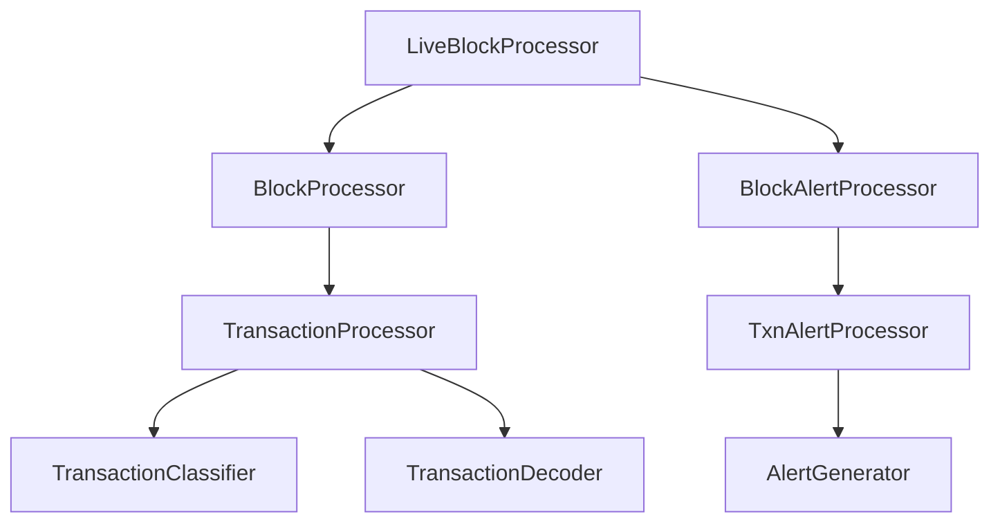
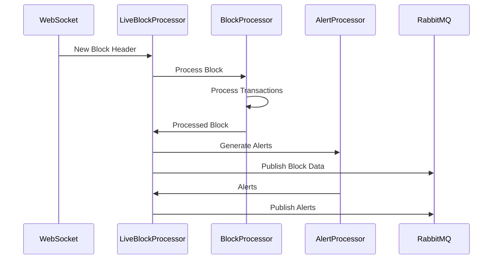

# Ethereum Block Processor

## Code Structure and Design

### 1. Core Components

### 2. Component Responsibilities

1. **LiveBlockProcessor**
   - Manages WebSocket connection for new blocks
   - Coordinates block processing and alert generation
   - Handles RabbitMQ message publishing
   - Implements reconnection and error recovery

2. **BlockProcessor**
   - Processes raw block data
   - Manages transaction processing pipeline
   - Extracts and validates block metadata
   - Coordinates parallel transaction processing

3. **BlockAlertProcessor**
   - Analyzes processed blocks for alerts
   - Manages concurrent alert processing
   - Aggregates alerts from multiple transactions
   - Implements alert prioritization

4. **TransactionProcessor**
   - Decodes transaction input data
   - Classifies transaction types
   - Extracts transfer information
   - Processes transaction receipts and logs

5. **TxnAlertProcessor**
   - Analyzes individual transactions
   - Detects specific patterns
   - Generates transaction-level alerts
   - Implements pattern matching logic

### 3. Data Flow

### 4. Key Design Patterns

1. **Asynchronous Processing**
   - Async/await throughout the codebase
   - Non-blocking I/O operations
   - Concurrent transaction processing
   - Event-driven architecture

2. **Dependency Injection**
   - Configurable components
   - Testable architecture
   - Flexible deployment options
   - Easy component replacement

3. **Error Handling**
   - Graceful degradation
   - Automatic recovery
   - Detailed error logging
   - Transaction-level isolation

4. **Message Queue Integration**
   - Persistent messaging
   - Separate exchanges
   - Automatic reconnection
   - Publisher confirms

### 5. Configuration Management

1. **Environment Variables**
   - Node URLs
   - RabbitMQ settings
   - Processing options
   - Logging configuration

2. **Runtime Configuration**
   - Alert thresholds
   - Processing limits
   - Reconnection delays
   - Cache settings

### 6. Performance Optimizations

1. **Batch Processing**
   - Parallel transaction processing
   - Bulk RPC requests using reth specific RPC calls
   - Batched database operations
   - Grouped alert generation
