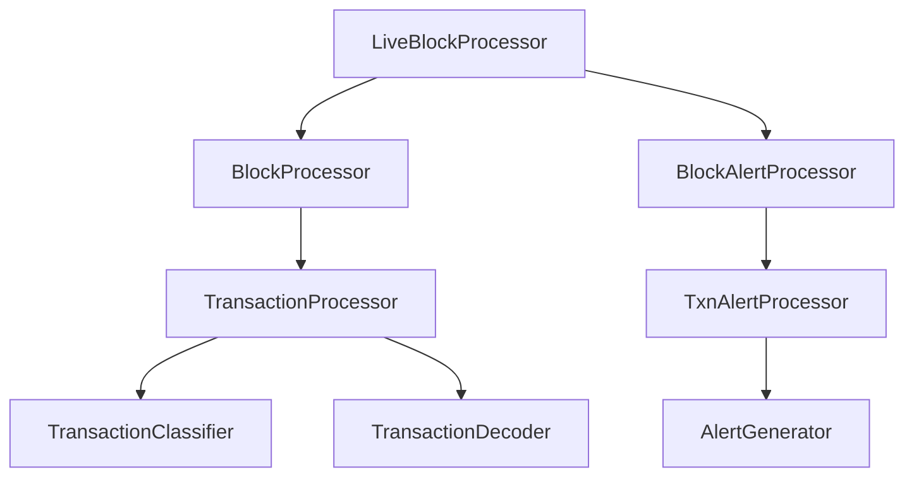
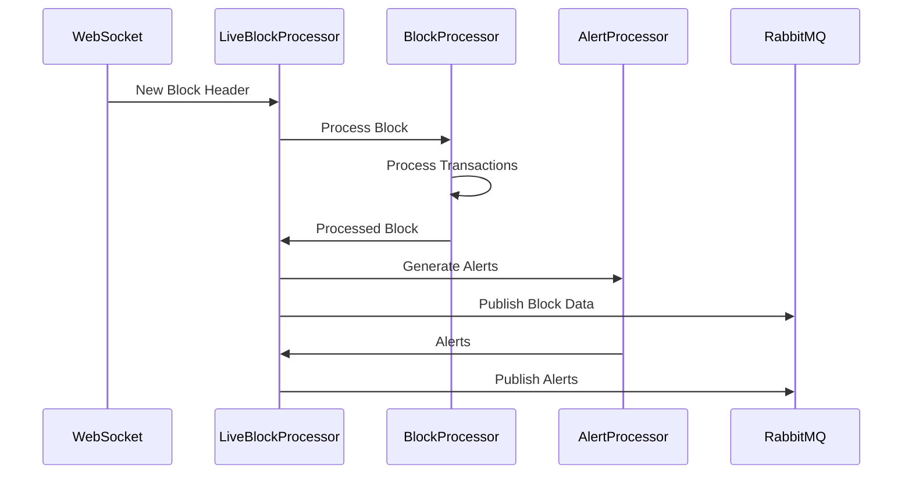

# Ethereum Block Processor

## Code Structure and Design

### 1. Core Components



### 2. Component Responsibilities

1. **LiveBlockProcessor**
   - Manages WebSocket connection for new blocks
   - Coordinates block processing and alert generation
   - Handles RabbitMQ message publishing
   - Implements reconnection and error recovery

2. **BlockProcessor**
   - Processes raw block data
   - Manages transaction processing pipeline
   - Extracts and validates block metadata
   - Coordinates parallel transaction processing

3. **BlockAlertProcessor**
   - Analyzes processed blocks for alerts
   - Manages concurrent alert processing
   - Aggregates alerts from multiple transactions
   - Implements alert prioritization

4. **TransactionProcessor**
   - Decodes transaction input data
   - Classifies transaction types
   - Extracts transfer information
   - Processes transaction receipts and logs

5. **TxnAlertProcessor**
   - Analyzes individual transactions
   - Detects specific patterns
   - Generates transaction-level alerts
   - Implements pattern matching logic

### 3. Data Flow



### 4. Key Design Patterns

1. **Asynchronous Processing**
   - Async/await throughout the codebase
   - Non-blocking I/O operations
   - Concurrent transaction processing
   - Event-driven architecture

2. **Dependency Injection**
   - Configurable components
   - Testable architecture
   - Flexible deployment options
   - Easy component replacement

3. **Error Handling**
   - Graceful degradation
   - Automatic recovery
   - Detailed error logging
   - Transaction-level isolation

4. **Message Queue Integration**
   - Persistent messaging
   - Separate exchanges
   - Automatic reconnection
   - Publisher confirms

### 5. Configuration Management

1. **Environment Variables**
   - Node URLs
   - RabbitMQ settings
   - Processing options
   - Logging configuration

2. **Runtime Configuration**
   - Alert thresholds
   - Processing limits
   - Reconnection delays
   - Cache settings

### 6. Performance Optimizations

1. **Batch Processing**
   - Parallel transaction processing
   - Bulk RPC requests using reth specific RPC calls
   - Batched database operations
   - Grouped alert generation


## Project Structure

```
eth_block_processor/
├── eth_block_processor/
│   ├── __init__.py
│   ├── blockchain/
│   │   ├── __init__.py
│   │   ├── live_block_processor.py    # Main block processing coordinator
│   │   ├── block_processor.py         # Block data extraction and processing
│   │   └── block_txn_processor.py   # Transaction analysis and decoding
│   │   └── block_fetcher.py          # Block fetching logic
│   │
│   ├── alert/
│   │   ├── __init__.py
│   │   ├── block_alert_processor.py   # Block-level alert processing
│   │   ├── txn_alert_processor.py     # Transaction-level alert generation
│   │   └── alert_types.py            # Alert type definitions
│   │   └── contract_creation_alert.py # Contract creation alert logic
│   │   └── trading_enabled_alert.py   # Trading enabled alert logic
│   │   └── bridge_alert.py          # Bridge alert logic
│   │   └── user_involved_alert.py   # User involved alert logic
│   │
│   ├── data_models/
│   │   ├── __init__.py
│   │   ├── block_data_models.py                  # Block data structures
│   │   ├── txn_models.py            # Transaction data structures
│   │   └── alert_models.py          # Alert data structures
│   │   └── receipt_models.py          # Receipt data structures
│   │   └── trace_models.py          # Trace data structures
│   │
│   ├── contracts/
│   |    ├── __init__.py
│   |    ├── contract_types.py
│   |    ├── function_signatures.py
│   |    └── contract_utils.py
│   |
│   ├── utils/
│       ├── __init__.py
│       ├── logger.py
│       └── type_converter.py
│
├── scripts/
│   └── process_blocks.py             # Main entry point
│   └── process_block_live.py         # Main entry point
│
├── tests/
│   ├── alert/
│   │   ├── test_alert_processor.py
│   │   └── test_alert_generator.py
│   ├── block/
│   │   ├── test_block_processor.py
│   │   └── test_block_fetcher.py
│   ├── txn/
│   │   ├── test_add_liquidity.py
│   │   └── test_approve.py
│   │   └── test_contract_creation.py
│   │   └── test_trading_enabled.py
│   │   └── test_set_tax.py
│   ├── conftest.py
│   
├── docs/
│   ├── block_processor.md            # Block processing documentation
│   └── alerts/
│       ├── alert_manager.md          # Alert system documentation
│       └── alert_types.md           # Alert type specifications
│
├── .env                             # Environment variables
├── .gitignore                       # Git ignore rules
├── requirements.txt                 # Project dependencies
└── README.md                        # Project overview
```