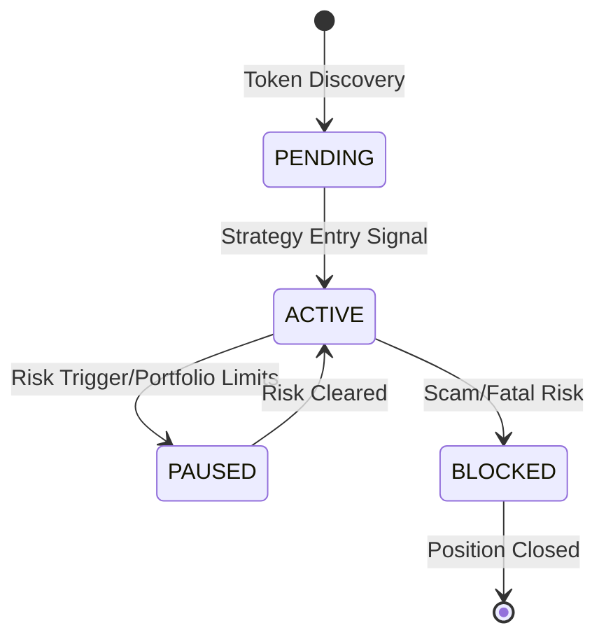

# Token Position Manager

## Overview
The Token Position Manager acts as an interface between individual token tracking (from `UserTokenActivityTracker`) and portfolio-level management. It aggregates token-specific data and provides portfolio-relevant metrics for decision making.


## Position States

### TokenPositionState
```python
class TokenPositionState(Enum):
    PENDING = "pending"   # Initial monitoring, no position yet
    ACTIVE = "active"    # Currently holding position
    PAUSED = "paused"    # Temporarily paused due to risk
    BLOCKED = "blocked"  # Permanently blocked (scam, etc)
```

## Token Position Data Model

### Core Position Data
```python
@dataclass
class TokenPosition:
    # Token Info (from UserTokenActivityTracker)
    token_address: str
    token_data: LiveERC20Token
    activity_tracker: UserTokenActivityTracker
    
    # Portfolio-specific Metrics
    portfolio_allocation: float      # % of total portfolio value
    max_allocation: float           # Maximum allowed allocation
    position_risk_score: float      # Current risk assessment
    
    # Position Management
    entry_strategy: str             # Strategy used for entry
    exit_strategy: str             # Current exit strategy
    take_profit_targets: List[float] # List of TP levels
    stop_loss_levels: List[float]   # List of SL levels
    
    # State Management
    position_state: TokenPositionState
    last_update_block: int
    last_update_time: datetime
```

## Integration with UserTokenActivityTracker

### Tracked Metrics from UserTokenActivityTracker
- `token_balance`: Current holding amount
- `denom_balance`: ETH value of position
- `realized_profit`: Actual profits from completed trades
- `unrealized_profit`: Paper profits/losses
- `total_profit`: Combined profits
- `num_trades`: Trading activity metrics
- `token_holdings_ratio`: Position size relative to total supply

### Additional Portfolio-level Metrics
1. **Risk Management**
   - Portfolio allocation percentage
   - Maximum allowed allocation
   - Risk score based on token metrics
   - Correlation with other positions

2. **Strategy Tracking**
   - Entry/exit strategy identifiers
   - Take profit levels
   - Stop loss levels
   - Strategy-specific parameters

3. **Performance Analytics**
   - Contribution to portfolio returns
   - Risk-adjusted returns
   - Drawdown contribution

## Position State Transitions



## Usage in Portfolio Management

1. **Position Creation**
   ```python
   def create_position(token: LiveERC20Token):
       # Get existing activity tracking
       activity = token.get_user_activity()
       
       # Create portfolio position
       position = TokenPosition(
           token_address=token.address,
           token_data=token,
           activity_tracker=activity,
           portfolio_allocation=0.0,
           position_state=TokenPositionState.PENDING
       )
       return position
   ```

2. **Position Updates**
   ```python
   def update_position(position: TokenPosition):
       # Update from activity tracker
       activity = position.activity_tracker
       
       # Update portfolio metrics
       position.portfolio_allocation = calculate_allocation()
       position.position_risk_score = assess_risk()
       
       # Check strategy conditions
       check_take_profit()
       check_stop_loss()
   ```

## Integration Points

1. **Portfolio State Manager**
   - Receives position updates
   - Manages overall allocation
   - Enforces portfolio-wide limits

2. **Investment Strategy**
   - Uses position data for decisions
   - Sets entry/exit points
   - Manages risk parameters

3. **Risk Manager**
   - Monitors portfolio exposure
   - Enforces position limits
   - Triggers risk-based state changes
