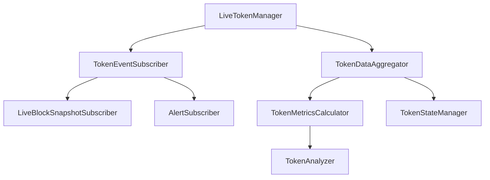
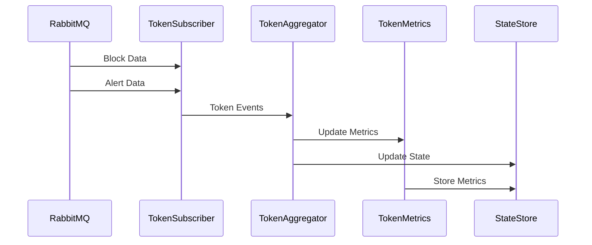
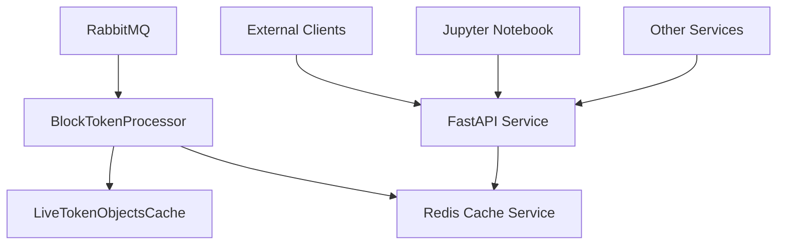

# Ethereum Live Token Manager

## Code Structure and Design

### 1. Core Components



### 2. Component Responsibilities

1. **LiveERC20Token**
   - Orchestrates token data processing
   - updates the token state in real-time with incoming tx data

2. **TokenEventSubscriber**
   - Subscribes to RabbitMQ exchanges
   - Processes incoming blocks and alerts
   - Routes events to appropriate handlers
   - Manages connection lifecycle

5. **LiveTokenManager**
   - Maintains a list of active tokens
   - Triggers events when certains conditions are met

### 3. Data Flow



### **Event-Driven Architecture**

- RabbitMQ Producer (Independent Process):
• Publishes processed block transactions to the “block_published_notifier.”
• Runs continuously, feeding new data onto the message queue.

- SubscriberManager & LiveBlockSnapshotSubscriber:
• The LiveBlockSnapshotSubscriber listens to “block_published_notifier” and receives new block data.
• Each incoming block (with transactions) is put into an in-memory asyncio.Queue within SubscriberManager via add_block().

- Processing Loop:
• SubscriberManager runs _process_blocks(), which dequeues blocks and iterates over each transaction.
• For each transaction, _process_transaction() is called.

- Live Token Lookup / Creation:
• _process_transaction() extracts all token addresses referenced by the transaction.
• For each token address:
– If it does not exist in live_tokens, create a new LiveToken instance.
– Otherwise, retrieve the existing LiveToken.

- Real-Time Updates:
• The LiveToken process_transaction() method updates the token’s internal LiveTokenData (e.g., ERC20 transfers, approvals, etc.) with the new transaction info.
• This maintains a continuously updated, in-memory state for each tracked token.

- Token Registry:
• live_tokens is a dictionary keyed by token address.
• token_first_seen tracks the first block in which a token was observed.
• These structures remain in memory for fast lookups and real-time updates.

- Outcome:
• As new blocks arrive, each relevant token’s LiveToken object is updated.
• The system continuously tracks any ERC20 tokens that appear in transactions, creating new LiveToken objects on demand and updating them if they already exist.


### Live ERC20 Token Processing - Real-Time Architecture
This design mirrors the historical approach but applies continuous, real-time updates. Instead of loading all transaction data at once, new transactions arrive via a subscription or message queue (e.g., RabbitMQ). The core principle remains the same: maintain token-specific data structures and a token network representing address balances and interactions.

#### Data Flow
1. Incoming Transactions
- Subscribe to block updates and extract ERC20 transactions relevant to the token.
- Push these transactions into an in-memory queue within a subscriber or manager class.

2. LiveERC20Token Update
- For each incoming transaction, parse the sender, receiver, and amount.
- Update the corresponding LiveERC20Token’s internal balances, transaction history, or other metrics (e.g., total volume, holders count).
Persist or log intermediate updates if necessary (e.g., for analytics or crash recovery).

#### Token Network Graph Maintenance

- As new transactions arrive, update the network graph:
   - Add or update node data (e.g., a new wallet address or an existing holder’s balance).
   - Create or modify edges representing the transfer (token edge, fee edge, etc.).
- Maintain real-time calculations (e.g., top holders, connected components if needed).

#### Real-Time Queries

- Expose methods to query the current state of a token (e.g., total holders, top addresses, real-time supply distribution).
- Optionally provide a mechanism for fast lookups or aggregates (e.g., caching partial results).

#### Implementation Steps
1. Initialize LiveERC20Token
- Similar constructor as the historical version but starting with minimal or default data (e.g., zero transactions, empty network).
- Load basic token metadata during the creation (e.g., name, symbol, decimals).

2. Subscription / Message Handling

- Listen for new blocks or transaction messages.
- Filter out non-relevant transactions (different token addresses).
For each relevant transaction, call a method on LiveERC20Token to apply the update.

3. Apply Transaction Updates

- Deduct the transferred amount from the sender, add it to the receiver.
- Increment transaction counts, track any event logs (approve, transfer, etc.).
- Update rolling metrics (e.g., anonymous whale trades, recent volume).
- If the address is new, instantiate a node in the network graph.
- If the address already exists, update the existing node’s balance and transaction count.

4. Network Graph Adjustments

- Use a structure similar to TokenNetworkBuilder for real-time edges in a dedicated “live” builder class.
- Manage concurrency (e.g., locks or async) to avoid race conditions when multiple transactions arrive simultaneously.
Data Persistence / Snapshot

- Periodically snapshot the updated state to storage or logs.
- Capture partial aggregates (e.g., block-level or time-based), so on restart you can quickly resume.

6. Monitoring and Error Handling

- If a transaction fails to process, log the error and continue with subsequent transactions.
- Implement reconnection / retry logic if the message queue or node subscription goes down.

#### Key Differences from Historical Processing

- Instead of bulk-loading historical data, the token state is incrementally updated in response to new transactions.
- Rolling metrics (balances, volumes, holders) must be continuously recalculated or adjusted rather than computed in one pass.
- Concurrency, race conditions, and partial updates should be handled carefully for production stability.

### 4. Token Cache Architecture



#### Cache Architecture Design

1. **Dual-Layer Caching**
   - In-Memory Cache (LiveTokenObjectsCache)
     * Fast access for real-time processing
     * Optimized for high-frequency updates
     * Memory-efficient with LRU eviction
   
   - Redis Persistence Layer
     * Distributed access across services
     * Persistence across restarts
     * Scalable storage solution

2. **Access Patterns**
   - Real-time Processing
     * Direct access via LiveTokenObjectsCache
     * Zero-latency updates for block processing
   
   - External Access
     * REST API via FastAPI
     * Standardized token data format
     * Rate-limited endpoints

3. **Data Flow**
   ```mermaid
   sequenceDiagram
       participant BP as BlockProcessor
       participant LC as LocalCache
       participant RC as RedisCache
       participant API as FastAPI
       participant Client
       
       BP->>LC: Update Token
       BP->>RC: Sync Update
       Client->>API: Request Token
       API->>RC: Fetch Token
       RC->>API: Return Token
       API->>Client: Response
   ```

#### Why This Architecture?

1. **Performance Benefits**
   - Local cache for processing speed
   - Redis for distributed access
   - Minimal inter-process communication

2. **Reliability Features**
   - Data persistence across restarts
   - Automatic failover capability
   - Consistent state management

3. **Scalability Advantages**
   - Horizontal scaling of API layer
   - Independent scaling of cache
   - Load distribution across services

4. **Integration Flexibility**
   - Standard REST API access
   - Multiple client support
   - Language-agnostic interface

#### Implementation Components

1. **TokenCacheService**
   - Redis backend integration
   - Atomic operations support
   - Serialization handling

2. **FastAPI Service**
   - Token data endpoints
   - Query parameters support
   - Rate limiting and security

3. **Monitoring & Metrics**
   - Cache hit/miss rates
   - API response times
   - Resource utilization

#### Usage Examples

1. **Jupyter Notebook Access**
```python
import aiohttp
import asyncio

async def get_token_data(token_address):
    async with aiohttp.ClientSession() as session:
        async with session.get(f"http://api:8000/tokens/{token_address}") as response:
            return await response.json()

# Usage
token_data = await get_token_data("0x123...")
```

2. **Service Integration**
```python
from token_cache_service import TokenCacheService

cache = TokenCacheService()
token = await cache.get_token("0x123...")
```
