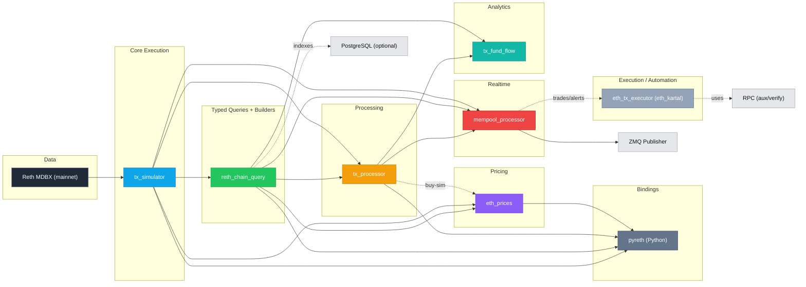

# Reth Workspace Overview

High-performance, Reth-powered Ethereum tooling built as a set of focused Rust crates. The workspace covers direct chain queries, fast EVM simulation, rich transaction processing, live mempool signal detection, execution utilities, Python bindings, and fund-flow analytics.

## Architecture

Data and control flow between crates (layered overview):

```
Reth MDBX (mainnet DB)
  ↓
tx_simulator  [core EVM + DB access]
  ├─→ reth_chain_query       [typed reads + AMM calldata builders]
  │     ├─→ tx_processor          [decode, traces, balance deltas]
  │     │     └─→ mempool_processor    [realtime signals → ZMQ]
  │     ├─→ eth_prices             [AMM/oracle price readers]
  │     └─→ pyreth                  [Python bindings]
  └─→ tx_processor              [direct simulation inputs]

Side integrations
  • tx_fund_flow  ⇐  { tx_processor, reth_chain_query }  [fund‑flow analytics]
  • eth_tx_executor (eth_kartal)  ⇐  mempool_processor alerts; uses RPC as needed
  • reth (vendored upstream for docs/examples; crates pinned to v1.7.0)
```

Shared assumptions
- Single local Reth database (default `~/.local/share/reth/mainnet`) reused across crates
- Pinned to Reth v1.7.0 across `tx_simulator`, `tx_processor`, `eth_prices`, `mempool_processor`, `reth_chain_query`
- Prefer direct DB access; RPC used only for comparison/aux checks

## Dependency Graph

Mermaid (render on GitHub/VS Code):



ASCII fallback:

```
Data
  Reth DB
    ↓
Core Execution
  tx_simulator
    ↓
Typed Queries + Builders
  reth_chain_query ──→ tx_processor ──→ mempool_processor ──→ ZMQ
        │                 │  └─→ eth_prices
        │                 └──────────────┐
        └────────→ eth_prices ───────────┘

Bindings: pyreth ⇐ {tx_simulator, reth_chain_query, tx_processor, eth_prices}
Analytics: tx_fund_flow ⇐ {reth_chain_query, tx_processor}
Indexes: reth_chain_query ⇢ PostgreSQL (optional)
Execution: eth_tx_executor (eth_kartal) uses RPC (aux/verify) and consumes trades/alerts
```

## Crates

### tx_simulator
- Purpose: Core EVM simulator and gateway to the local Reth MDBX database. Simulates unsigned/signed calls, sequential chains, block traces, and view functions with full call frames.
- Depends on: Reth (v1.7.0 crates), REVM, Alloy types
- Used by: `reth_chain_query`, `tx_processor`, `eth_prices`, `mempool_processor`, `pyreth`
- Key: `TxSimulator`, `UnsignedTransaction`, `FullSimulationResult`
- Docs: `../tx_simulator/README.md`

### reth_chain_query
- Purpose: Fast, typed blockchain queries on top of `tx_simulator` plus AMM calldata builders. Adds entity-centric indexes and PostgreSQL helpers.
- Depends on: `tx_simulator`, Reth provider/db crates
- Used by: `tx_processor`, `eth_prices`, `mempool_processor`, `pyreth`, `tx_fund_flow`
- Key: `ChainQuery` (balances, storage, tx/blocks), `tx_builders` (Uniswap v2/v3 routes)
- Docs: `rust/reth_chain_query/README.md`, `rust/reth_chain_query/src/tx_builders/README.md`

### tx_processor
- Purpose: Convert raw/simulated transactions to rich `ProcessedTransaction` objects: decoded logs, internal calls, address balance deltas, and tax calculations. Orchestrates “buy → approve → sell” viability checks via builders from `reth_chain_query` and simulation via `tx_simulator`.
- Depends on: `tx_simulator`, `reth_chain_query`, Reth crates
- Used by: `mempool_processor`, `eth_prices` (buy-sim utilities), `pyreth`, `tx_fund_flow`
- Key: `ProcessedTxProvider`, `TxProcessor`, `tax_calculator`
- Docs: `rust/tx_processor/README.md`

### eth_prices
- Purpose: Zero-latency price readers that query AMMs (Uniswap V2/V3, Sushi, Curve, Balancer, PancakeV3, Dodo, Fraxswap) and Chainlink, directly from Reth DB. Includes aggregated reader and arbitrage helpers.
- Depends on: `reth_chain_query`, `tx_simulator`, `tx_processor` (for buy-sim paths)
- Used by: `pyreth`
- Key: `price_readers/*`, `AggregatedPriceReader`
- Docs: `rust/eth_prices/README.md`

### mempool_processor
- Purpose: Realtime mempool pipeline with function detection, routing, simulation, tax/tradability checks, and signal emission (trading enabled, high-tax/honeypot, liquidity removal, etc.). Publishes via ZMQ and logs performance.
- Depends on: `tx_processor`, `tx_simulator`, `reth_chain_query`, Reth/REVM/Alloy
- Used by: Operations stack, downstream bots; integrates with Python token tracking service
- Key: `MempoolFetcherIPCClient`, `FunctionDetector`, `TransactionRouter`, `SimulationManager`, `SignalManager`
- Docs: `../mempool_processor/README.md`, plus `src/signal_detector/README.md`, `src/bin/README.md`

### pyreth
- Purpose: Python bindings that expose `ChainQuery`, `TxProcessor`, `TxSimulator`, price readers, and selected simulators to Python with a stable `ProcessedTransaction` schema.
- Depends on: `tx_simulator`, `tx_processor`, `reth_chain_query`, `eth_prices`
- Used by: Python analytics & services
- Docs: `rust/pyreth/README.md`, `rust/pyreth/src/python/tx_processor/README.md`

### tx_fund_flow
- Purpose: Fund-flow network analytics. Consumes `ProcessedTransaction` from `tx_processor` and uses `reth_chain_query` for DB-backed queries. Focuses on network construction, ranking, and interactive analysis.
- Depends on: `tx_processor`, `reth_chain_query` (path deps in subcrates)
- Used by: Research/analytics
- Docs: `rust/tx_fund_flow/README.md`, `rust/tx_fund_flow/src/fundflownetwork/README.md`

### eth_tx_executor (eth_kartal)
- Purpose: Execution utilities and transaction ranking system for protective or automated actions (keystore mgmt, gas optimization, risk checks, alert processing).
- Depends on: internal `tx_ranking_system`, ethers, REVM, ZMQ, Postgres
- Used by: Ops/automation
- Docs: `rust/eth_tx_executor/tx_ranking_system/README.md`, project docs under `rust/eth_tx_executor/docs/`

### reth (vendored)
- Purpose: Upstream Reth repository included for docs/examples and local development. Local crates pull Reth crates via git (tag v1.7.0) for compatibility.
- Docs: `rust/reth/README.md`

## How They Work Together
- Query path: `tx_simulator` opens the Reth DB and provides state/tracing; `reth_chain_query` offers typed, high-level queries and calldata builders on top.
- Processing path: `tx_processor` simulates and decodes transactions into `ProcessedTransaction`; tax math uses the decoded balance deltas.
- Prices: `eth_prices` reads AMM/oracle state directly; for strategy testing it can call into `tx_simulator`/`tx_processor` for buy-sim flows.
- Realtime: `mempool_processor` classifies mempool txs, simulates effects, computes taxes/tradability, and emits signals.
- Python: `pyreth` provides a single-process, shared-handle entry to all of the above with consistent schemas.
- Analytics/Execution: `tx_fund_flow` builds fund-flow networks; `eth_tx_executor` focuses on response/automation.

## Prerequisites
- Reth node with local DB: `~/.local/share/reth/mainnet` (default). Stop the node when doing heavy simulation to avoid MDBX locks.
- Rust 1.70+ and a modern toolchain
- Optional: `/tmp/reth.ipc` for mempool IPC

## Quick Start
- Prices: `cargo run -p eth_prices --example all_price_feeds_aggregated`
- Processing: `cargo run -p tx_processor --example process_transaction_by_hash -- <tx_hash>`
- Mempool signals: `cargo run -p mempool_processor --bin mempool_signal_detector -- --ipc-path /tmp/reth.ipc --reth-db-path ~/.local/share/reth/mainnet`
- Python: `pip install pyreth` then see `rust/pyreth/README.md` for examples

## Conventions
- Share a single simulator/provider across components to minimize DB handle churn
- Keep Reth crate versions aligned at v1.7.0
- Use checksum addresses and decimal strings for big ints across Rust↔Python boundaries

## Code Placement Guide (Keep It Clean)

- Simulation engine: `tx_simulator`
  - Raw EVM execution, DB access, view calls, unsigned/signed tx simulation, sequential chains, block traces
  - No protocol/business decoding, no tax math, no signal logic

- Chain queries + builders: `reth_chain_query`
  - High-level typed reads (balances, storage, receipts), time↔block conversion, PostgreSQL helpers
  - Stateless AMM calldata builders (Uniswap v2/v3), router/spender resolution per route
  - No simulation, no event decoding beyond what’s needed for DB queries, no tax logic

- Transaction processing: `tx_processor`
  - Convert simulation outputs to `ProcessedTransaction`: decode logs/events, internal calls, address balance deltas
  - Classification (e.g., swaps, transfers), tax calculator (buy/sell tax), pool viability orchestration
  - Uses builders from `reth_chain_query` and simulation from `tx_simulator`

- Price readers: `eth_prices`
  - Read AMM/oracle state directly from DB; aggregate, compute statistics, arbitrage checks
  - Optional buy-sim demonstrations can call into `tx_simulator`/`tx_processor`

- Realtime detection: `mempool_processor`
  - Function detection, routing, simulation orchestration, tax/tradability checks, signal emission, publishing
  - No deep decoding library: rely on `tx_processor` for canonical processing and tax computation

- Python bindings: `pyreth`
  - Thin pyo3 wrappers; no business logic. Ensure Rust↔Python `ProcessedTransaction` schema compatibility

- Analytics: `tx_fund_flow`
  - Fund-flow network building/analysis using `ProcessedTransaction` + DB queries from `reth_chain_query`
  - No simulation or decoding logic duplication

- Execution/automation: `eth_tx_executor`
  - Keystore mgmt, gas/ranking, alert processing; separated from core DB/simulation path

## Boundaries and Anti‑Patterns

- Don’t add protocol-specific decoding to `tx_simulator` or `reth_chain_query` (keep them stateless/typed)
- Don’t duplicate calldata builders in `tx_processor` or `eth_prices`; use `reth_chain_query::tx_builders`
- Don’t reimplement tax logic in `mempool_processor`; compute via `tx_processor`
- Don’t put analytics in `pyreth`; bindings only
- Keep Reth crate versions consistent across dependent crates
- Prefer DB-over-RPC in performance-sensitive paths; isolate RPC usage to examples/verification

## Testing Ownership

- `tx_simulator`: correctness of simulation types, traces, block equivalence vs RPC
- `reth_chain_query`: table coverage and typed query accuracy (spot-checked vs RPC)
- `tx_processor`: event decoding, trace processing, balance deltas, tax calculator golden tests
- `eth_prices`: per-protocol price parity tests and aggregated stats sanity
- `mempool_processor`: detector decisions on curated tx sets; end-to-end timing assertions
- `pyreth`: schema fidelity tests against Python dataclasses; round-trip conversions
- `tx_fund_flow`: network construction integrity and metrics on sample datasets

## Adding New Functionality (Examples)

This section is a practical guide for where new code belongs and how to wire it across crates while keeping boundaries clean.

### 1) New AMM Route (e.g., Uniswap V4)

- reth_chain_query (stateless calldata builders)
  - Add route variant (e.g., `AmmSwapRoute::UniswapV4 { pool, … }`).
  - Implement builders under `src/tx_builders/amm/v4.rs`:
    - `build_buy_swap_v4(_with_min_out)` / `build_sell_swap_v4(_with_min_out)`
    - `build_approve_v4` (router spender)
  - Wire dispatch in `src/tx_builders/mod.rs`:
    - Route-aware `build_buy_swap`/`build_sell_swap`/`build_approve_for_route`
    - `spender_for_route(&AmmSwapRoute)` returns v4 router address
  - Keep builders stateless: no DB reads; all input params are provided by callers.

- tx_processor (orchestration + viability)
  - Extend buy→approve→sell simulators/analyzers to accept the new `AmmSwapRoute`.
  - Use existing flow: build unsigned txs with `reth_chain_query::tx_builders` → simulate via `tx_simulator` → convert to `ProcessedTransaction` → compute taxes/flags.
  - Only add decoding if v4 introduces new events you care about; otherwise balance deltas + existing decoders suffice.

- eth_prices (optional real-time pricing)
  - Add a V4 price reader under `src/price_readers/amm/uniswap_v4/*`.
  - Prefer direct state reads where layouts are stable; fall back to view-function simulation via a shared simulator when necessary.
  - Register in the aggregated reader and add examples.

- mempool_processor (optional)
  - If you need route-specific detection, add function signatures to `FunctionDetector` and any route-specific heuristics; avoid duplicating processing logic.

- pyreth (optional Python exposure)
  - Expose new route and simulators with thin wrappers; reuse `PyProcessedTransaction` schema.

- Examples/Tests
  - Add `examples/pool_analysis/can_buy_sell_uniswap_v4.rs` (exists) and price reader demos.
  - Golden tests for tax/viability on known pools if available.

Principle: Builders live in reth_chain_query, simulation in tx_simulator, interpretation in tx_processor, pricing in eth_prices. Don’t mix responsibilities.

### 2) New Signal Type (e.g., LP Approval Risk)

- function detection
  - Extend `FunctionDetector` with relevant selectors/topics (e.g., Permit/Approval events) for fast routing.

- routing
  - Update `tx_router` categories/priorities if this signal should short-circuit into high-priority analysis.

- detection logic
  - Implement under `src/signal_detector/*` as a focused detector that consumes `ProcessedTransaction` (from `tx_processor`).
  - Use decoded events and address balance deltas computed by `tx_processor`; don’t reimplement tax or decoding here.
  - Pull token/pool context from the token cache when comparisons against prior state are needed.

- signal manager and publishing
  - Register the detector in `SignalManager`; enforce dedup/history rules.
  - Reuse existing ZMQ publisher and metrics format; don’t fork schemas unless strictly necessary.

- tests/telemetry
  - Add curated tx samples and end-to-end assertions (latency budget, duplicate prevention, thresholds).

Principle: Detection is context + decision. All decoding and tax math come from tx_processor; mempool_processor only coordinates and decides.

### 3) New Python-Facing Feature

- implement in Rust first
  - Add the core capability to the appropriate Rust crate (`reth_chain_query` for fetching, `tx_processor` for processing, `eth_prices` for pricing, etc.).

- expose via pyreth (bindings only)
  - Add a thin pyo3 wrapper under `src/python/...` that calls into the Rust API.
  - For transactions, return `PyProcessedTransaction` and use `.to_dict()` for Python dataclasses compatibility.
  - Share the same underlying simulator/provider (singleton-style) to avoid extra DB handles.

- docs/examples
  - Update `rust/pyreth/README.md` and add a minimal example under `rust/pyreth/examples/*`.

Principle: pyreth never owns business logic; it projects stable, lossless schemas to Python.

### 4) New Chain Query or Index

- Add typed reads in `reth_chain_query` (not in tx_simulator).
- For new analytics indexes (e.g., arrivals, address summaries), implement under `reth_chain_query::postgres_db` (or the existing index module), with small, composable queries.
- Keep query surfaces narrow and latency-aware; prefer DB-native scans over ad hoc RPC.

### 5) New Price Source or Aggregation

- Implement source reader under `eth_prices::price_readers::<type>/<source>`.
- Decide access pattern: direct storage vs view-function simulation via a shared simulator.
- Register with `AggregatedPriceReader` and extend examples/benchmarks.

Checklist (for any new feature)
- Place code in the correct crate per responsibilities above.
- Reuse `tx_builders` and `ProcessedTransaction`; avoid duplicating calldata assembly or decoding/tax math.
- Keep Reth versions aligned; reuse shared simulator/provider handles.
- Add examples and minimal golden tests to anchor behavior.
