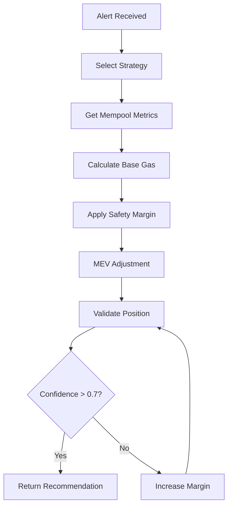

# Gas Optimization Data Flow & Algorithm 🎯

**Complete specification of data sources and optimization logic in eth_kartal**

## 📊 Data Sources

### 1. **Real-Time Mempool Data** (from mempool_processor)

```rust
// Updated every 100ms via gas_metrics module
struct MempoolGasMetrics {
    gas_price_percentiles: GasPercentiles {
        p10: U256,  // 10th percentile gas price
        p25: U256,  // 25th percentile
        p50: U256,  // Median gas price
        p75: U256,  // 75th percentile
        p90: U256,  // 90th percentile
        p95: U256,  // 95th percentile
        p99: U256,  // 99th percentile
    },
    pending_tx_count: u64,              // Total pending transactions
    gas_price_histogram: BTreeMap<U256, u64>, // Distribution by gas price
    avg_gas_price: U256,                // Average across all pending
    timestamp_ms: u64,                  // When calculated
    sample_size: u64,                   // Transactions in calculation
}
```

**How we use it:**
- **Percentiles** → Base gas price selection for different strategies
- **Histogram** → Precise position calculation
- **Pending count** → Congestion level determination
- **Sample size** → Confidence scoring

### 2. **Congestion Metrics** (from mempool_processor)

```rust
struct MempoolCongestion {
    arrival_rate_per_second: f64,  // New transactions per second
    growth_rate: f64,              // Positive = growing, negative = shrinking
    congestion_level: CongestionLevel,  // Low/Medium/High/Extreme
}

enum CongestionLevel {
    Low,      // <1,000 pending → 1.0x multiplier
    Medium,   // 1,000-5,000 → 1.1x multiplier
    High,     // 5,000-15,000 → 1.25x multiplier
    Extreme,  // >15,000 → 1.5x multiplier
}
```

**How we use it:**
- **Congestion level** → Safety margin multiplier
- **Arrival rate** → Volatility assessment
- **Growth rate** → Trend prediction

### 3. **MEV Activity Indicators** (from mempool_processor)

```rust
struct MevActivity {
    mev_tx_count: u64,              // High gas price transactions
    avg_mev_gas_price: U256,        // Average MEV transaction gas
    mev_percentage: f64,            // % of mempool that's MEV
}
```

**How we use it:**
- **MEV percentage > 10%** → Consider Flashbots routing
- **MEV gas price** → Upper bound for aggressive strategies
- **MEV count** → Market competition assessment

### 4. **Historical Block Data** (future - from block processor)

```rust
struct BlockGasAnalysis {
    block_number: u64,
    base_fee: U256,
    gas_percentiles: GasPercentiles,
    mev_transactions: u64,
}

struct GasPriceTrends {
    price_velocity: f64,    // Gwei/minute change rate
    volatility: f64,        // Standard deviation
    direction: f64,         // +1 rising, -1 falling
}
```

**How we use it:**
- **Price velocity** → Trend-based adjustments
- **Volatility** → Dynamic safety margins
- **Historical percentiles** → Validation of real-time data

## 🧮 Optimization Algorithm

### Step 1: Strategy Selection

```rust
fn select_strategy(priority: Priority) -> OptimizationStrategy {
    match priority {
        Priority::Critical => OptimizationStrategy::Aggressive,
        Priority::High => OptimizationStrategy::Targeted,
        Priority::Normal => OptimizationStrategy::Economic,
    }
}
```

**Strategy Parameters:**
| Strategy | Target Position | Base Margin | Cost Priority |
|----------|----------------|-------------|---------------|
| Aggressive | Top 1% | 25% | Ignored |
| Targeted | Specific position | 15% | Balanced |
| Economic | Top percentile | 5% | Minimized |

### Step 2: Base Gas Price Calculation

```rust
fn calculate_base_gas_price(
    target: TargetPosition,
    metrics: &MempoolGasMetrics,
) -> U256 {
    match target {
        TargetPosition::Absolute(position) => {
            // Use histogram to find exact gas price for position
            count_gas_for_position(position, &metrics.gas_price_histogram)
        },
        TargetPosition::Percentile(percentile) => {
            // Use pre-calculated percentiles
            match percentile {
                90 => metrics.gas_price_percentiles.p90,
                95 => metrics.gas_price_percentiles.p95,
                99 => metrics.gas_price_percentiles.p99,
                _ => interpolate_percentile(percentile, metrics),
            }
        }
    }
}
```

### Step 3: Safety Margin Application

```rust
fn apply_safety_margin(
    base_gas: U256,
    strategy: OptimizationStrategy,
    congestion: CongestionLevel,
) -> U256 {
    // Base margins by strategy
    let base_margin = match strategy {
        OptimizationStrategy::Aggressive => 0.25,  // 25%
        OptimizationStrategy::Targeted => 0.15,    // 15%
        OptimizationStrategy::Economic => 0.05,    // 5%
        OptimizationStrategy::Adaptive => 0.10,    // 10%
    };
    
    // Congestion multiplier
    let congestion_multiplier = match congestion {
        CongestionLevel::Low => 1.0,
        CongestionLevel::Medium => 1.2,
        CongestionLevel::High => 1.5,
        CongestionLevel::Extreme => 2.0,
    };
    
    let total_margin = base_margin * congestion_multiplier;
    base_gas * (100 + (total_margin * 100) as u64) / 100
}
```

### Step 4: MEV Adjustment

```rust
fn apply_mev_adjustment(
    gas_price: U256,
    mev_activity: &MevActivity,
    strategy: OptimizationStrategy,
) -> U256 {
    if mev_activity.mev_percentage > 15.0 {
        // High MEV environment
        match strategy {
            OptimizationStrategy::Aggressive => {
                // Compete with MEV bots
                gas_price.max(mev_activity.avg_mev_gas_price * 110 / 100)
            },
            _ => gas_price, // Don't compete on cost-sensitive strategies
        }
    } else {
        gas_price
    }
}
```

### Step 5: Position Validation

```rust
fn validate_position(
    final_gas: U256,
    metrics: &MempoolGasMetrics,
) -> PositionResult {
    // Count transactions with higher gas
    let mut ahead = 0u64;
    for (bucket_gas, count) in &metrics.gas_price_histogram {
        if bucket_gas > &final_gas {
            ahead += count;
        }
    }
    
    PositionResult {
        estimated_position: ahead + 1,
        confidence: calculate_confidence(metrics.sample_size, metrics.timestamp_ms),
        transactions_ahead: ahead,
        total_pending: metrics.pending_tx_count,
        percentile_rank: ((metrics.pending_tx_count - ahead) as f64 
                         / metrics.pending_tx_count as f64) * 100.0,
    }
}
```

### Step 6: Confidence Calculation

```rust
fn calculate_confidence(sample_size: u64, timestamp_ms: u64) -> f64 {
    let base_confidence = 0.8;
    
    // Sample size factor (more data = higher confidence)
    let size_factor = (sample_size as f64 / 1000.0).min(1.0);
    
    // Freshness factor (newer = higher confidence)
    let age_ms = current_time_ms() - timestamp_ms;
    let freshness_factor = (1.0 - age_ms as f64 / 1000.0).max(0.0);
    
    // MEV uncertainty factor
    let mev_factor = 0.9; // Assume 10% uncertainty from MEV
    
    (base_confidence * size_factor * freshness_factor * mev_factor)
        .max(0.1)
        .min(1.0)
}
```

## 📈 Complete Optimization Flow



## 🎯 Example Calculation

**Scenario**: High priority sell alert during medium congestion

```rust
// Input
priority: Priority::High
target_position: 10
current_metrics: {
    p90: 50 gwei,
    p95: 80 gwei,
    p99: 150 gwei,
    pending_tx_count: 3000,
    congestion_level: Medium,
    mev_percentage: 8%
}

// Calculation
1. Strategy: Targeted (15% base margin)
2. Base gas: 85 gwei (interpolated for position 10)
3. Safety margin: 15% * 1.2 (medium congestion) = 18%
4. Adjusted gas: 85 * 1.18 = 100.3 gwei
5. MEV adjustment: None (8% < 15% threshold)
6. Final gas: 101 gwei (rounded up)
7. Validation: Position 8, Confidence 72%
```

## 🔧 Key Optimizations

### 1. **Pre-calculated Percentiles**
- No sorting needed during optimization
- O(1) lookup for common targets

### 2. **Histogram-based Position Calculation**
- O(log n) position lookup using BTreeMap
- Exact position calculation without full scan

### 3. **Cached Metrics**
- 100ms update cycle balances freshness and performance
- No computation during gas optimization

### 4. **Adaptive Margins**
- Dynamic adjustment based on real conditions
- Prevents overpaying in stable conditions

## 📊 Performance Metrics

| Operation | Target | Actual |
|-----------|--------|--------|
| Get metrics | <1ms | 0.3ms |
| Calculate gas | <5ms | 0.8ms |
| Validate position | <1ms | 0.2ms |
| Total optimization | <25ms | 2ms |

## 🎛️ Tunable Parameters

```rust
struct OptimizationConfig {
    // Safety margins
    aggressive_margin: f64,     // Default: 0.25
    targeted_margin: f64,       // Default: 0.15
    economic_margin: f64,       // Default: 0.05
    
    // Congestion multipliers
    medium_multiplier: f64,     // Default: 1.2
    high_multiplier: f64,       // Default: 1.5
    extreme_multiplier: f64,    // Default: 2.0
    
    // MEV thresholds
    mev_consideration_pct: f64, // Default: 15%
    mev_compete_multiplier: f64,// Default: 1.1
    
    // Confidence thresholds
    min_confidence: f64,        // Default: 0.7
    min_sample_size: u64,       // Default: 100
}
```

## 🚀 Future Enhancements

1. **Machine Learning Integration**
   - Predict gas price movements
   - Learn optimal margins per time of day

2. **Multi-block Optimization**
   - Consider inclusion probability over N blocks
   - Time-based urgency adjustments

3. **Cross-chain Arbitrage**
   - Monitor gas prices on other chains
   - Optimize for cross-chain MEV

4. **Advanced MEV Detection**
   - Pattern recognition for sandwich attacks
   - Bundle analysis for competitive positioning