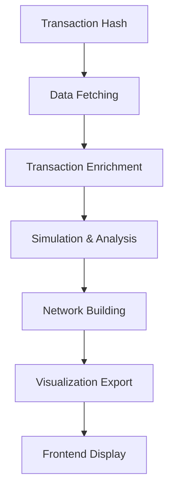

# QARQA Architecture Flow - Transaction to Network

## 🎯 **Overview**

This document explains the complete data flow architecture of QARQA, from receiving a transaction hash to building and visualizing the fund flow network.

## 🔄 **High-Level Flow**



## 📊 **Detailed Step-by-Step Process**

### **Step 1: Input - Transaction Hash**
```
User provides: 0xf7bd63f7b673646734cf259824bf2c0fa698b3474dff1fcce410acd86bdbd1ae
```

### **Step 2: Data Fetching (data_access module)**

#### **2.1 Load Basic Transaction Data**
```rust
// In TransactionFetcher
let tx_data = fetch_transaction_from_db(tx_hash)?;
```

**Fetches from `transactions` table:**
- `from_address`: Transaction initiator
- `to_address`: Recipient (or contract)
- `value`: ETH amount in wei
- `gas_price`, `gas_used`: Gas costs
- `block_number`, `timestamp`: When it happened
- `status`: Success/Failed

#### **2.2 Load Internal ETH Transfers**
```rust
// Query internal_transfers table
let internal_transfers = fetch_internal_transfers(tx_hash)?;
```

**Internal transfers include:**
- ETH movements between contracts
- ETH sent from contracts to addresses
- Self-destruct transfers
- ETH created/destroyed in contract calls

**Example internal transfer:**
```
WETH Contract → 0x6bDf3535... : 10.829 ETH
0x6bDf3535... → Uniswap V4   : 10.829 ETH
```

#### **2.3 Load ERC-20 Token Transfers**
```rust
// Query token_transfers table
let token_transfers = fetch_token_transfers(tx_hash)?;
```

**Token transfers include:**
- All ERC-20 Transfer events
- Token contract address
- From/To addresses
- Amount (raw, needs decimal adjustment)

**Example token transfer:**
```
Uniswap V4 → 0x6bDf3535... : 27,158.423268 USDC
0xfBd4cdB4 → Uniswap V3     : 6.729 WETH
```

### **Step 3: Transaction Enrichment**

#### **3.1 Combine All Data**
```rust
let complete_transaction = Transaction {
    hash: tx_hash,
    from_address,
    to_address,
    value,
    gas_price,
    gas_used,
    internal_transfers,  // Vec<EthMovement>
    token_transfers,     // Vec<TokenMovement>
    // ... other fields
};
```

#### **3.2 Add Token Metadata**
```rust
// Enrich token transfers with symbols and decimals
for transfer in &mut token_transfers {
    let token_info = fetch_token_metadata(transfer.token_address)?;
    transfer.token_symbol = token_info.symbol;    // e.g., "USDC"
    transfer.token_decimals = token_info.decimals; // e.g., 6
}
```

### **Step 4: Transaction Simulation (tx_simulation module)**

#### **4.1 Extract Fund Flows**
```rust
let fund_flow_analyzer = FundFlowAnalyzer::new();
let fund_flows = fund_flow_analyzer.analyze_transaction(&complete_transaction)?;
```

**Fund flow analysis combines:**
- Direct ETH transfer (if value > 0)
- All internal ETH transfers
- All token transfers
- Gas payment flow

**Example fund flow:**
```rust
FundFlow {
    from_address: User,
    to_address: Network,
    eth_amount: 0.0039,  // Gas payment
    token_flows: [],
    movement_types: ["Gas Payment"],
}
```

#### **4.2 Calculate State Changes**
```rust
let state_analyzer = StateChangeAnalyzer::new();
let state_changes = state_analyzer.analyze_transaction(&complete_transaction)?;
```

**For each address involved:**
1. Calculate ETH balance change
2. Calculate each token balance change
3. Determine net change across all assets
4. Apply significance threshold

**Example state change calculation:**
```
Address: 0xfBd4cdB4... (Router)
- ETH in: 0, ETH out: 0         → Net: 0
- WETH in: 0, WETH out: 23.055  → Net: -23.055 WETH
- USDC in: 27,158, USDC out: 0  → Net: +27,158 USDC
- USDT in: 30,637, USDT out: 0  → Net: +30,637 USDT
```

### **Step 5: Network Building (network_building module)**

#### **5.1 Create Network Nodes**
```rust
let network_builder = NetworkBuilder::new();

// For each address with meaningful state change
for (address, state_change) in state_changes {
    let node = NetworkNode {
        address,
        entity_type: classify_entity(address), // User/Pool/Contract/Token
        net_eth_change: state_change.eth_change,
        total_value_change: calculate_total_value(state_change),
        // ... other properties
    };
    network_builder.add_node(node);
}
```

**Entity Classification:**
- **User**: EOA that initiated transaction
- **Network**: 0x0000...0000 (gas recipient)
- **Pool**: Uniswap V3/V4, Curve, etc.
- **Token**: WETH, token contracts
- **Router**: Complex routing contracts

#### **5.2 Create Network Edges**
```rust
// For each fund flow
for flow in fund_flows {
    let edge = NetworkEdge {
        from_node: flow.from_address,
        to_node: flow.to_address,
        eth_amount: flow.eth_amount,
        token_flows: flow.token_flows,
        edge_type: classify_edge_type(&flow),
        // ... other properties
    };
    network_builder.add_edge(edge);
}
```

**Edge Classification:**
- **Gas Payment**: Gray - Transaction fees
- **ETH Transfer**: Blue - Direct ETH movements
- **Stablecoin**: Green - USDC, USDT, DAI
- **WETH**: Blue - Treated as ETH
- **Token**: Purple - Other ERC-20 tokens

#### **5.3 Apply Filtering & Optimization**
```rust
// CRITICAL: Filter intermediaries
let filtered_network = network_builder
    .filter_intermediaries()  // Remove zero net change addresses
    .combine_weth_with_eth()  // Treat WETH as ETH
    .optimize_layout()        // Position nodes for clarity
    .build()?;
```

**Intermediary Filtering Logic:**
```rust
fn is_intermediary(node: &NetworkNode) -> bool {
    // Check if all asset changes are zero
    node.net_eth_change.abs() < THRESHOLD &&
    node.net_token_changes.values().all(|v| v.abs() < THRESHOLD)
}
```

**IMPORTANT DISCOVERY**: Some complex transactions have NO intermediaries!

### **Step 6: Visualization Export**

#### **6.1 Convert to Cytoscape Format**
```rust
let cytoscape_data = CytoscapeExporter::export(&filtered_network)?;
```

**Cytoscape format structure:**
```json
{
  "elements": {
    "nodes": [
      {
        "data": {
          "id": "0x5B43453FCE04b92E190f391a83136bfBeCEDEFd1",
          "label": "User",
          "type": "user",
          "net_change": -0.0039
        }
      }
    ],
    "edges": [
      {
        "data": {
          "source": "0x5B43...",
          "target": "0x0000...",
          "eth_amount": 0.0039,
          "type": "gas"
        }
      }
    ]
  }
}
```

#### **6.2 Generate Network Statistics**
```rust
let stats = NetworkStatistics {
    total_nodes: network.nodes.len(),
    total_edges: network.edges.len(),
    total_eth_volume: calculate_total_eth_volume(&network),
    complexity_score: calculate_complexity(&network),
};
```

### **Step 7: Frontend Display (Sarigoz)**

#### **7.1 API Response**
```python
# In fundflow_network_api.py
network_data = {
    "nodes": cytoscape_nodes,
    "edges": cytoscape_edges,
    "stats": network_statistics,
    "metadata": {
        "transaction_hash": tx_hash,
        "block_number": block_num,
        "timestamp": timestamp
    }
}
```

#### **7.2 Frontend Rendering**
```javascript
// In fund_flow_network.html
function renderNetwork(networkData) {
    // Initialize Cytoscape
    const cy = cytoscape({
        container: document.getElementById('cy'),
        elements: networkData.elements,
        style: getNetworkStyles(),
        layout: { name: 'cose-bilkent' }
    });
    
    // Update fund flow table
    updateFundFlowTable(networkData.edges);
}
```

## 🔍 **Complete Example Flow**

### **Input Transaction**
```
0xf7bd63f7b673646734cf259824bf2c0fa698b3474dff1fcce410acd86bdbd1ae
```

### **Step-by-Step Processing**

**1. Fetch Transaction Data:**
```sql
SELECT * FROM transactions WHERE hash = '0xf7bd63...';
-- Returns: from_address, to_address, value, gas, block, etc.
```

**2. Fetch Internal Transfers:**
```sql
SELECT * FROM internal_transfers WHERE transaction_hash = '0xf7bd63...';
-- Returns: 4 internal ETH movements
```

**3. Fetch Token Transfers:**
```sql
SELECT * FROM token_transfers WHERE transaction_hash = '0xf7bd63...';
-- Returns: 8 ERC-20 token movements
```

**4. Build Complete Transaction Object:**
```rust
Transaction {
    internal_transfers: 4 ETH movements,
    token_transfers: 8 token movements,
    // ... other fields
}
```

**5. Extract Fund Flows:**
- Identify unique from/to pairs
- Aggregate movements by address pair
- Classify movement types

**6. Calculate State Changes:**
```
8 addresses involved:
- User: -0.0039 ETH (gas only)
- Network: +0.0039 ETH (gas received)
- WETH: -16.325 ETH
- V4 Pool: +16.325 ETH, -40,930 USDC, -13,772 USDT
- V3 Pool: +6.729 WETH, -16,865 USDT
- 0x6bDf3535: +10.829 WETH
- 0x3177F690: +5.496 WETH
- 0xfBd4cdB4: -23.055 WETH, +27,158 USDC, +30,637 USDT
```

**7. Build Network:**
- 8 nodes (all have meaningful changes)
- Multiple edges representing fund flows
- No intermediaries to filter

**8. Export for Visualization:**
```json
{
  "nodes": 8,
  "edges": [
    {"from": "User", "to": "Network", "amount": 0.0039, "type": "gas"},
    {"from": "WETH", "to": "V4", "amount": 16.325, "type": "eth"},
    {"from": "V4", "to": "V3", "usdc": 40930, "usdt": 13772, "type": "stablecoin"},
    {"from": "V3", "to": "WETH", "amount": 6.729, "type": "weth"}
  ]
}
```

## 🏗️ **Key Architectural Decisions**

### **1. Modular Pipeline**
Each module has a single responsibility:
- `data_access`: Fetch raw data
- `tx_simulation`: Analyze and extract flows
- `network_building`: Construct graph
- `api_layer`: Coordinate and serve

### **2. Data Enrichment Strategy**
- Fetch all data upfront (no lazy loading)
- Enrich with metadata (symbols, decimals)
- Calculate derived values (USD amounts)

### **3. Intermediary Filtering**
- Calculate net changes for ALL assets
- Only filter if ALL changes are below threshold
- Preserve complex routing contracts

### **4. WETH Treatment**
- Always combine WETH with ETH amounts
- Display as ETH in visualizations
- Maintain distinction in raw data

### **5. Performance Optimization**
- O(1) database lookups via participants table
- Batch fetch all related data
- Stream processing for large transactions

## 📈 **Performance Characteristics**

| Stage | Typical Duration | Bottleneck |
|-------|-----------------|------------|
| Data Fetching | 5-10ms | Database queries |
| Enrichment | 1-2ms | Token metadata cache |
| Simulation | 5-20ms | Complex calculations |
| Network Building | 2-5ms | Graph algorithms |
| Export | 1-2ms | JSON serialization |
| **Total** | **15-40ms** | Database I/O |

## 🔧 **Error Handling Flow**

Each stage handles errors gracefully:

1. **Database Errors**: Retry with exponential backoff
2. **Missing Data**: Use defaults or skip enrichment
3. **Simulation Errors**: Log and return partial results
4. **Network Building**: Always produce valid graph
5. **Export Errors**: Fallback to simple format

## 🚀 **Future Enhancements**

1. **Caching Layer**: Cache complete networks by tx_hash
2. **Streaming Processing**: Handle transactions with 1000+ transfers
3. **Real-time Updates**: WebSocket for live transaction monitoring
4. **ML Integration**: Automatic pattern recognition
5. **Multi-chain Support**: Extend beyond Ethereum

This architecture provides a robust, scalable foundation for blockchain transaction analysis and fund flow visualization.