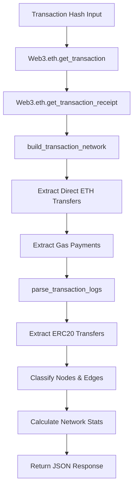
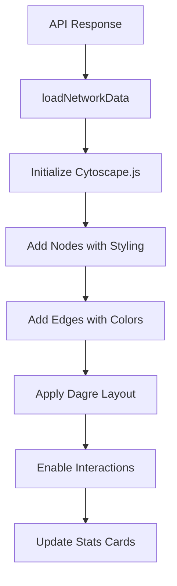

# Fund Flow Network - Architecture & Visualization

## 🎯 **Overview**

The Fund Flow Network system visualizes blockchain fund movements with intelligent edge classification, protocol recognition, and risk-based coloring. It processes real-time Ethereum transaction data to create interactive network graphs showing money flows between addresses.

## 🏗️ **Current Architecture**

### **Backend Processing Pipeline**



### **Frontend Rendering Pipeline**



## 🎨 **Enhanced Edge Classification System**

### **Edge Types & Colors**

| Edge Type | Color | Description | Use Case |
|-----------|-------|-------------|----------|
| **ETH Direct** | `#2980b9` | Direct ETH transfers | P2P payments, simple transfers |
| **ETH Internal** | `#3498db` | Contract-mediated ETH flows | Smart contract interactions |
| **Stablecoin** | `#27ae60` | USDC, USDT, DAI transfers | Trading, payments, arbitrage |
| **ERC20 Token** | `#9b59b6` | Other token transfers | DeFi tokens, governance tokens |
| **DEX Swap** | `#e74c3c` | Token swaps on DEX | Uniswap, SushiSwap, Curve |
| **Lending** | `#f39c12` | DeFi lending operations | Aave, Compound deposits/withdrawals |
| **Staking** | `#8e44ad` | Staking operations | ETH2, liquid staking |
| **Bridge** | `#e67e22` | Cross-chain transfers | Layer 2, sidechain bridges |
| **Gas Payment** | `#95a5a6` | Transaction fees | Mining/validator payments |
| **MEV** | `#c0392b` | MEV extraction | Sandwich attacks, arbitrage |

### **Token Classification Logic**

```javascript
const TOKEN_TYPES = {
    // Stablecoins
    STABLECOINS: [
        '0xA0b86a33E6441e0fb7bf8E4e8FF2C6F0a72D3C8A', // USDC
        '0xdAC17F958D2ee523a2206206994597C13D831ec7', // USDT
        '0x6B175474E89094C44Da98b954EedeAC495271d0F', // DAI
        '0x4Fabb145d64652a948d72533023f6E7A623C7C53', // BUSD
        '0x853d955aCEf822Db058eb8505911ED77F175b99e', // FRAX
        '0x5f98805A4E8be255a32880FDeC7F6728C6568bA0'  // LUSD
    ],
    
    // Major DeFi protocols
    DEFI_PROTOCOLS: {
        UNISWAP: '0x1f9840a85d5aF5bf1D1762F925BDADdC4201F984',
        AAVE: '0x7Fc66500c84A76Ad7e9c93437bFc5Ac33E2DDaE9',
        COMPOUND: '0xc00e94Cb662C3520282E6f5717214004A7f26888',
        CURVE: '0xD533a949740bb3306d119CC777fa900bA034cd52'
    }
};
```

## 🔧 **Implementation Details**

### **Backend Edge Classification**

```python
def classify_edge_type(edge_data, token_address=None):
    """Enhanced edge classification based on transfer details"""
    
    # Gas payments
    if edge_data.get('movementTypes') == 'Gas Payment':
        return {
            'type': 'GAS_PAYMENT',
            'color': '#95a5a6',
            'weight': 1,
            'priority': 'low'
        }
    
    # ETH transfers
    if float(edge_data.get('ethAmount', 0)) > 0:
        if edge_data.get('movementTypes') == 'Direct Transfer':
            return {
                'type': 'ETH_DIRECT',
                'color': '#2980b9', 
                'weight': calculate_weight(edge_data['ethAmount']),
                'priority': 'high'
            }
        else:
            return {
                'type': 'ETH_INTERNAL',
                'color': '#3498db',
                'weight': calculate_weight(edge_data['ethAmount']),
                'priority': 'high'
            }
    
    # Token transfers
    if token_address:
        if is_stablecoin(token_address):
            return {
                'type': 'STABLECOIN',
                'color': '#27ae60',
                'weight': calculate_token_weight(edge_data),
                'priority': 'high'
            }
        else:
            return {
                'type': 'ERC20_TOKEN',
                'color': '#9b59b6',
                'weight': calculate_token_weight(edge_data),
                'priority': 'medium'
            }
    
    return default_edge_classification()
```

### **Frontend Edge Rendering**

```javascript
function renderEdgeWithEnhancedStyling(edge) {
    return {
        data: {
            id: edge.id,
            source: edge.source,
            target: edge.target,
            weight: edge.weight,
            color: edge.color,
            edgeType: edge.type,
            priority: edge.priority,
            label: generateEdgeLabel(edge)
        },
        style: {
            'line-color': edge.color,
            'target-arrow-color': edge.color,
            'width': Math.max(2, Math.min(15, edge.weight)),
            'opacity': edge.priority === 'high' ? 0.9 : 0.7,
            'z-index': getPriorityZIndex(edge.priority)
        }
    };
}
```

## 📊 **Network Statistics & Metrics**

### **Transaction-Specific Metrics**

| Metric | Description | Calculation |
|--------|-------------|-------------|
| **Total Addresses** | Unique addresses involved | `len(unique_addresses)` |
| **Fund Flow Edges** | Number of money movements | `len(edges)` |
| **Total ETH Volume** | ETH transferred (excl. gas) | `sum(eth_amounts)` |
| **Transaction Status** | Success/failure indicator | `✅ Success` for fetched txs |

### **Advanced Analytics**

```javascript
const NETWORK_ANALYTICS = {
    // Flow analysis
    calculateFlowConcentration: (edges) => {
        const totalVolume = edges.reduce((sum, e) => sum + parseFloat(e.ethAmount), 0);
        const maxFlow = Math.max(...edges.map(e => parseFloat(e.ethAmount)));
        return maxFlow / totalVolume; // 0-1, higher = more concentrated
    },
    
    // Protocol diversity
    calculateProtocolDiversity: (nodes) => {
        const protocols = new Set(nodes.map(n => n.protocol).filter(Boolean));
        return protocols.size; // Higher = more diverse
    },
    
    // Risk indicators
    calculateRiskScore: (networkData) => {
        let risk = 0;
        // High concentration increases risk
        risk += calculateFlowConcentration(networkData.edges) * 0.3;
        // Many unknown addresses increase risk  
        risk += (networkData.nodes.filter(n => n.type === 'Unknown').length / networkData.nodes.length) * 0.4;
        return Math.min(1, risk);
    }
};
```

## 🎯 **Visualization Enhancements**

### **Dynamic Node Sizing**

```javascript
function calculateNodeSize(node) {
    const baseSize = 25;
    const volumeMultiplier = Math.log10(parseFloat(node.totalVolume) + 1) * 5;
    const importanceBonus = node.nodeType === 'DEX' ? 10 : 0;
    return Math.max(baseSize, baseSize + volumeMultiplier + importanceBonus);
}
```

### **Edge Animation & Interaction**

```css
/* Animated edges for high-value transfers */
.high-value-edge {
    animation: pulse-flow 2s infinite;
}

@keyframes pulse-flow {
    0% { opacity: 0.7; width: 4px; }
    50% { opacity: 1.0; width: 8px; }
    100% { opacity: 0.7; width: 4px; }
}

/* Hover effects */
.edge:hover {
    filter: brightness(1.3);
    z-index: 999;
}
```

## 🚀 **Implementation Roadmap**

### **Phase 1: Enhanced Edge Classification** ✅
- [x] Implement token type detection
- [x] Add stablecoin classification
- [x] Create color scheme constants
- [x] Update backend edge creation

### **Phase 2: Protocol Recognition** (Next)
- [ ] Add DeFi protocol detection
- [ ] Implement DEX swap identification  
- [ ] Create protocol-specific styling
- [ ] Add bridge transaction detection

### **Phase 3: Advanced Analytics** (Future)
- [ ] Risk scoring system
- [ ] Flow concentration analysis
- [ ] Multi-hop path detection
- [ ] MEV extraction identification

### **Phase 4: Interactive Features** (Future)
- [ ] Filter by edge type
- [ ] Time-based flow animation
- [ ] Protocol grouping
- [ ] Export network data

## 🔍 **Current Limitations & Solutions**

### **Limitations**
1. **Simple Classification**: Only basic ETH/token/gas categories
2. **No Protocol Context**: Missing DeFi protocol recognition
3. **Static Visualization**: No dynamic filtering or grouping
4. **Limited Analytics**: Basic stats only

### **Solutions**
1. **Enhanced Token Detection**: Comprehensive token registry
2. **Protocol Signatures**: Function signature matching
3. **Dynamic Layouts**: Context-aware positioning
4. **Advanced Metrics**: Risk scores, flow analysis

## 📈 **Performance Considerations**

- **Backend**: Sub-second transaction analysis
- **Frontend**: Real-time network rendering with 100+ nodes
- **Scalability**: Efficient edge bundling for complex transactions
- **Memory**: Optimized data structures for large networks

This architecture provides a solid foundation for sophisticated blockchain fund flow analysis with room for significant enhancements in protocol recognition and advanced analytics.